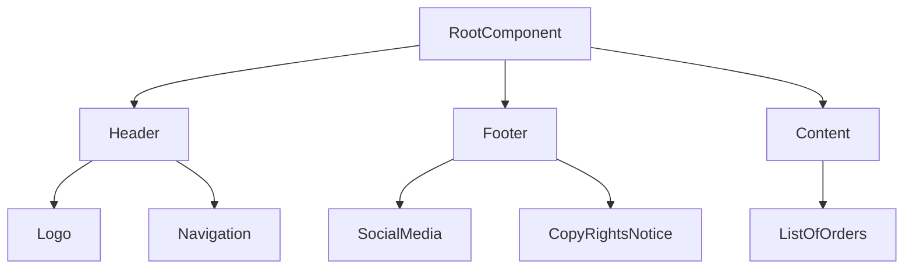

<!-- headingDivider: 2 -->
<!--fit-->
<!--
theme: gaia
class: lead
-->

<style>
 {
  font-size: 1.75em;
 }

</style>

# Vue.js Essentials

## What is Vue.js?

- A progressive framework for building user interfaces
- No need to make multiple requests to the server
- very lean and lightweight (only 20kb minified)

## Installing Vue.js

 

## Vue.js Instance
- A Vue.js instance is created by calling the `Vue` function
  - an instance can controller several components
  - it controls the data, methods, and lifecycle of the components
  - `new Vue({})` is the syntax for creating a Vue.js instance

## Vue.js Instance Options
- `el` - element to mount the instance to. root element! `el: '#app'`
- `data` - data object to be used in the instance `data: {}`
- `methods` - methods to be used in the instance `methods: {}`
- `computed` - computed properties to be used in the instance `computed: {}`
```ts
new Vue({
  el: '#app',
  data: {
    message: 'Hello Vue.js!'
  },
  methods: {
    reverseMessage() {
      this.message = this.message.split('').reverse().join('')
    }
  }
  }
})
```

## this in Vue.js data
- `this` refers to the Vue.js instance
- data is accessed using `this` in the instance
- for example in methods, `this.message` refers to the data object
```ts
new Vue({
  el: '#app',
  data: {
    message: 'Hello Vue.js!'
  },
  methods: {
    reverseMessage() {
      this.message = this.message.split(''+n('')
    }
  }
  }
})
```

## Data Binding
- we can bind data to the DOM using `v-bind` or `:` in the template
- we can bind data to the DOM using `v-on` or `@` in the template
```html
<div id="app">
  <p>{{ message }}</p>
  <button v-on:click="reverseMessage">Reverse Message</button>
  <a :href="url">Vue.js</a>
</div>
<script>
  new Vue({
    el: '#app',
    data() return {
      message: 'Hello Vue.js!',
      url: 'https://vuejs.org/'
    }
  })

</script>
```
## vue html element Binding
- we can add html elements to the DOM using `v-html` in the template
```html
<div id="app">
  <p>{{ message }}</p>
  <button v-on:click="reverseMessage">Reverse Message</button>
  <a :href="url">Vue.js</a>
  <div v-html="html"></div>
</div>
<script>
  new Vue({
    el: '#app',
    data() return {
      message: 'Hello Vue.js!',
      url: 'https://vuejs.org/',
      html: '<h1>Vue.js</h1>'
    })
</script>
```

## vue event modifiers
- we can add event modifiers to the DOM using `v-on` in the template or `@` in the template
- events are triggered when the user interacts with the DOM
- some list of event modifiers
  - `v-on:click.once` - triggers when the user clicks on the element once and only once
  - `v-on:click.prevent` - prevents the default behavior of the event

## vue keyboard event modifiers
- some list of keyboard event modifiers
  - `v-on:keyup.enter` - triggers when the user presses the enter key
  - `v-on:keyup.esc` - triggers when the user presses the escape key
  - `v-on:keyup.tab` - triggers when the user presses the tab key
  - `v-on:keyup.delete` - triggers when the user presses the delete key
  - `v-on:keyup.backspace` - triggers when the user presses the backspace key
  - `v-on:keyup.space` - triggers when the user presses the space key
  - `v-on:keyup.up` - triggers when the user presses the up arrow key
  - `v-on:keyup.down` - triggers when the user presses the down arrow key
  - `v-on:keyup.left` - triggers when the user presses the left arrow key
  - `v-on:keyup.right` - triggers when the user presses the right arrow key
  - multiple modifiers can be used together
  - `v-on:keyup.enter.space` - triggers when the user presses the enter and space key
  - `v-on:keyup.enter.space.prevent` - triggers when the user presses the enter and space key and prevents the default behavior of the event

## vue two way data binding
- we can bind data to the DOM using `v-model` in the template
- `v-model` is a shorthand for `v-bind:value` and `v-on:input`
- `v-model` is used for input elements like `input`, `textarea`, and `select` this will update the data when the user interacts with the DOM

```html
<div id="app">
  <p>{{ message }}</p>
  <button v-on:click="reverseMessage">Reverse Message</button>
  <a :href="url">Vue.js</a>
  <div v-html="html"></div>
  <input type="text" v-model="message">
</div> 
<script>
  new Vue({
    el: '#app',
    data() return {
      message: 'Hello Vue.js!',
      url: 'https://vuejs.org/',
      html: '<h1>Vue.js</h1>'
    })
</script>
```

## vue computed properties
- `computed` is an object that contains the computed properties
- every time the data changes, the computed properties are re-evaluated
- computed properties are only re-evaluated when their dependencies change
```html
  <script>
    export default {
      name: 'App',
      data() {
        return {
          value1: 0,
          value2: 0} },
      computed: {
        totalSum() {
          console.log('totalSum')
          return this.value1 + this.value2}}}
  </script>
```
## Dynamic CSS Classes
- we can add dynamic CSS classes to the DOM using `v-bind:class` in the template or `:` in the template
- it take in key value pairs where the key is the CSS class and the value is a boolean
- example if `isActive` is true, the CSS class `active` will be added to the DOM
```html
<div v-bind:class="{ active: isActive }"></div>
<div :class="{ active: isActive }"></div>
```

## conditional v-if , v-else-if, v-show
- we can add conditional rendering to the DOM using `v-if` in the template
- `v-if` is used to render the DOM if the condition is true
- `v-else-if` is used to render the DOM if the condition is true
- `v-else` is used to render the DOM if the condition is true
- `v-show` is different from `v-if` in that `v-show` will always render the DOM but will use the CSS property `display: none` to hide the DOM
```html
<div v-if="isActive">Active</div>
<div v-else-if="isInactive">Inactive</div>
<div v-else>Unknown</div>
<div v-show="isActive">Active</div>
```

## looping v-for
- we can add looping to the DOM using `v-for` in the template 
- `v-for` is used to render the DOM for each item in the array
- `v-for` can also be used to render the DOM for each item in the object
```html
<div v-for="item in items" :key="item.id">{{ item.name }}</div>
<div v-for="(item, index) in items" :key="item.id">{{ index }} - {{ item.name }}</div>
<div v-for="(value, key, index) in object" :key="index">{{ index }} - {{ key }} - {{ value }}</div>
```

## multiple vue instances
- we can create multiple vue instances using `new Vue()`
- each vue instance will have its own data, methods, computed properties, and lifecycle hooks
```js
var app1 = new Vue({
  el: '#app1',
  data: {
    message: 'Hello Vue.js!'
  }
})
var app2 = new Vue({
  el: '#app2',
  data: {
    message: 'Hello Vue.js!'
  }
})
```

## vue components
- we can create reusable components using `Vue.component()`
- components are reusable Vue instances with a name
- components can be registered globally or locally
- to register a component globally, we use `Vue.component()`
- to register a component locally, we use `components` in the `Vue` instance
```js
// global component
Vue.component('app-servers', {
  template: '<h1>Hello Vue.js!</h1>'
})
// local component
new Vue({
  el: '#app',
  components: {
    'app-servers': {
      template: '<h1>Hello Vue.js!</h1>'
    }
  }
})
```
## vue referencing with refs
- we can reference the DOM using `$ref` in the template
- `$ref` is used to reference the DOM element 
- to get 'yourAddress' from the DOM, we can use `this.$refs.yourAd
- dress.value`
```html
<input type="text" ref="yourAddress">
<script>
  export default {
    name: 'App',
    methods: {
      submit() {
        console.log(this.$refs.yourAddress.value)
      }
    }
  }
</script>
```
## Vui CLI
- Vue CLI is a command line interface for Vue.js
  - Uses ES6 syntax
  - compile and bundle the code
  - Single file template
  - Hot reloading

## Nesting components
- for large projects we split the components into smaller components
- we can nest components inside other components
- we need to register the nested components in the parent component
  - we can register the nested components globally or locally
    - locally `components: { 'app-servers': AppServers }`
    - globally `Vue.component('app-servers', AppServers)`

## Scoped Components Classe
* Issue
  * when we style the components, the styles are applied globally and can affect other components
* Solution
  * we can scope the styles to the component using `scoped` in the style tag
  * `scoped` will only apply the styles to the component and not to the other components

```html
<style scoped>
  .red {
    color: red;
  }
</style>
```

## Example of nested components

* Issue
  * we have a component that has a list of servers
  * we have a component that has a list of users
  * we want to reuse the list of servers and users in the other components
  * it will be easier to maintain the code if we reuse the components
* Solution
  * we can create a component that has a list of servers
  * we can create a component that has a list of users
  * we can reuse the components in the other components
  * Nested components are called in template using `<name-of-component></name-of-component>`
```html
<template>
  <div>
    <app-servers></app-servers>
    <app-users></app-users>
  </div>
</template>
<script>
  import AppServers from './AppServers'
  import AppUsers from './AppUsers'
  export default {
    name: 'App',
    components: {
      'app-servers': AppServers,
      'app-users': AppUsers
    }
  }
</script>
```
## reusing components Example
Here is a simple flow chart:



## Passing data to components (props)
* Problem
  * We have several components that have the same data
  * We want to reuse the components
  * We want to pass the data to the components
* Solution
*  We can pass data to the components using `props`
```html
<template>
  <div>
    <app-servers :servers="servers"></app-servers>
    <app-users :users="users"></app-users>
  </div>
</template>
<script>
  import AppServers from './AppServers'
  import AppUsers from './AppUsers'
  export default {
    name: 'App',
    components: {
      'app-servers': AppServers,
      'app-users': AppUsers
    },
    data() {
      return {
        servers: [
          { id: 1, name: 'Server 1' },
          { id: 2, name: 'Server 2' },
          { id: 3, name: 'Server 3' }
        ],
        users: [
          { id: 1, name: 'User 1' },
          { id: 2, name: 'User 2' },
          { id: 3, name: 'User 3' }
        ]
      }
    }
  }
```

## receiving data in components (props)
```html
<template>
  <div>
    <h1>Servers</h1>
    <ul>
      <li v-for="server in servers" :key="server.id">{{ server.name }}</li>
    </ul>
  </div>
</template>
<script>
  export default {
    name: 'AppServers',
    props: ['servers']
  }
</script>
```

## props validation
* Problem
  * when we pass data to the components, we can pass any data type to the components
  * we want to validate the data type of the props
* Solution
  * we can validate the data type of the props using `props`
  * we can validate the data type of the props using `type`
  * we can validate the data type of the props using `required`
  * we can validate the data type of the props using `default`
```html
<template>
  <div>
    <h1>Servers</h1>
    <ul>
      <li v-for="server in servers" :key="server.id">{{ server.name }}</li>
    </ul>
  </div>
</template>
<script>
  export default {
    name: 'AppServers',
    props: {
      servers: {
        type: Array,
        required: true
        default: []
      }
    }
  }
</script>
```
## Primitive and Reference Types
* Primitive Types
  * String
  * Number
  * Boolean
  * Null
  * Undefined
  * Symbol
* Reference Types
  * Object
  * Array
  * Function
```js
// primitive type
let a = 1
let b = a
a = 2
console.log(a) // 2
console.log(b) // 1
// reference type
let a = { name: 'a' }
let b = a
a.name = 'b'
console.log(a.name) // b
console.log(b.name) // b
```

## Events (child to parent)
* Problem
  * we want to pass data from the child component to the parent component
  * say we have a component that has a list of employees
  * we want to pass the selected employee to the parent component
* Solution
  * we can pass data from the child component to the parent component using 
  * `events`
  * `$emit`
  * `@event-name`
```html
<template>
  <div>
    <h1>Employees</h1>
    <ul>
      <li v-for="employee in employees" :key="employee.id" @click="selectEmployee(employee)">{{ employee.name }}</li>
    </ul>
  </div>
</template>
<script>
  export default {
    name: 'AppEmployees',
    props: {
      employees: {
        type: Array,
        required: true,
        default: []
      }
    },
    methods: {
      selectEmployee(employee) {
        this.$emit('employee-selected', employee)
      }
    }
  }
</script>
// parent component
<template>
  <div>
    <app-employees :employees="employees" @employee-selected="employeeSelected"></app-employees>
  </div>
</template>
<script>
  import AppEmployees from './AppEmployees'
  export default {
    name: 'App',
    components: {
      'app-employees': AppEmployees
    },
    data() {
      return {
        employees: [
          { id: 1, name: 'Employee 1' },
          { id: 2, name: 'Employee 2' },
          { id: 3, name: 'Employee 3' }
        ]
      }
    },
    methods: {
      employeeSelected(employee) {
        console.log(employee)
      }
    }
  }
</script>
```

## Event Bus
* Problem
  * listening to events from a component is not a good practice, and can lead to spaghetti code
  * we want to have a global event bus, i.e a global event listener
* Solution
  * we can create a global event bus using 
    * `Vue`
    * `Vue.prototype`
    * `$on`
    * `$emit`
    * `$off`
    * `$once`
    * `$off`
## lifecycle hooks
* Problem
  * we want to execute some code when a component is created
  * we want to execute some code when a component is destroyed
  * we want to execute some code when a component is updated
* Solution
  * we can execute some code when a component is created using 
    * `created` (beforeCreate --> created --> beforeMount --> mounted)
    * `mounted` (mounted--> beforeUpdate --> updated)
    * `updated` (updated --> beforeDestroy --> destroyed)
    * `destroyed` (destroyed)


## lifecycle hooks example
```html
<script>
  export default {
    methods: {
    beforeCreate() {
      console.log('beforeCreate')
    },
    created() {
      console.log('created')
    },
    beforeMount() {
      console.log('beforeMount')
    },
    mounted() {
      console.log('mounted')
    },
    beforeUpdate() {
      console.log('beforeUpdate')
    },
    updated() {
      console.log('updated')
    },
    beforeDestroy() {
      console.log('beforeDestroy')
    },
    destroyed() {
      console.log('destroyed')
    }
  }
}
</script>
```